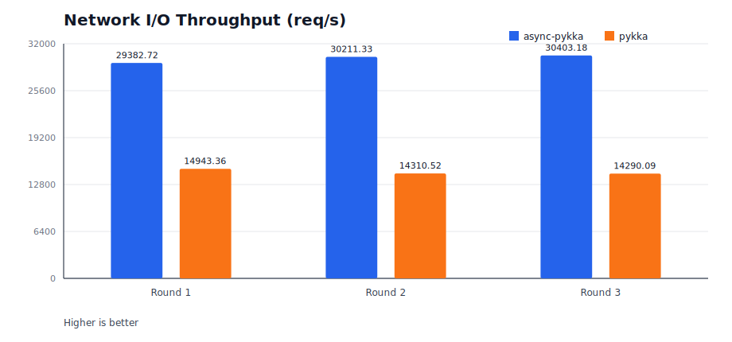
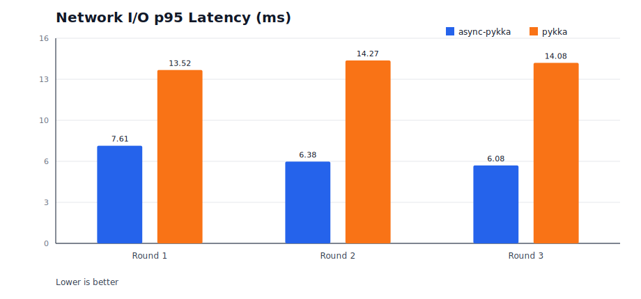

<div align="center">
  <h1>async-pykka</h1>
  <h3>面向 Python 的 asyncio-first Actor 模型框架</h3>

  <p>
    
    
    
    <a href="https://github.com/yzbf-lin/async-pykka/actions/workflows/ci.yml"></a>
  </p>

**中文** | [English](README.md)

</div>

---

`async-pykka` 是一个纯 `asyncio` 的框架，基于 [Actor 模型](https://en.wikipedia.org/wiki/Actor_model) 实现，延续 Pykka 风格 API，重点优化 I/O 密集场景下的吞吐与延迟表现。

[快速示例](examples/quickstart_counter.py) | [场景说明](docs/scenarios.md) | [性能文档](docs/performance.md) | [常见问题](docs/faq.md)

> [!IMPORTANT]
> **同一事件循环约束**
> 所有 Actor 操作必须运行在同一个 event loop 中。跨线程/跨 loop 调用会快速失败并抛出 `RuntimeError`。

## ✨ 核心特性

- 保留熟悉的 Actor API：`start / proxy / ask / tell / stop`
- asyncio-first 调度模型，不依赖 Actor 线程池
- 内置异步代理与注册表，支持大规模 Actor 管理
- 严格 loop 绑定安全模型，便于线上问题定位

## 📥 安装方式

PyPI 项目地址：<https://pypi.org/project/async-pykka/>

### 方式 1：通过 PyPI 安装（推荐）

```bash
pip install -U async-pykka
```

### 方式 2：固定版本安装（可选）

```bash
pip install async-pykka==X.Y.Z
```

### 方式 3：通过 Git tag 安装（备选）

```bash
pip install "git+https://github.com/yzbf-lin/async-pykka.git@vX.Y.Z"
```

### 方式 4：通过源码归档安装（无需 git）

```bash
pip install "https://github.com/yzbf-lin/async-pykka/archive/refs/tags/vX.Y.Z.tar.gz"
```

### 方式 5：通过 Release wheel 安装

```bash
pip install "https://github.com/yzbf-lin/async-pykka/releases/download/vX.Y.Z/async_pykka-X.Y.Z-py3-none-any.whl"
```

请将 `X.Y.Z` 替换为目标发布版本号。
导入包名：`async_pykka`。

## 🚀 5 分钟上手

```bash
uv venv
uv sync --group dev
uv run python examples/quickstart_counter.py
uv run pytest -q
```

预期输出：`counter=5`

## 🧩 最小示例

```python
import asyncio
import async_pykka


class GreeterActor(async_pykka.AsyncioActor):
    def __init__(self, name: str):
        super().__init__()
        self.name = name

    async def greet(self) -> str:
        return f"Hello, {self.name}!"


async def main() -> None:
    ref = GreeterActor.start("World")
    proxy = ref.proxy()

    message = await proxy.greet()
    print(message)

    await ref.stop()


if __name__ == "__main__":
    asyncio.run(main())
```

## 📦 核心 API

| API | 说明 |
| --- | --- |
| `AsyncioActor` | Actor 基类 |
| `ActorRef.tell(msg)` | 发送消息，不等待返回 |
| `ActorRef.ask(msg)` | 请求-响应 `Future` |
| `ActorRef.proxy()` | 异步代理调用入口 |
| `ActorProxy.set(name, value)` | 安全设置 Actor 内部状态 |
| `ActorRegistry.stop_all()` | 批量优雅关闭 |
| `Future.get(timeout=...)` | 支持超时等待 |

## 🧠 常见模式

### 带超时的请求响应

```python
future = ref.ask({"type": "query", "key": "profile"})
result = await future.get(timeout=1.0)
```

### Notify 入队 + 批处理

高频 notify 事件先入队，再批量消费，避免处理抖动。

可运行示例：[`examples/notify_batch.py`](examples/notify_batch.py)

### 优雅停机

```python
results = await async_pykka.ActorRegistry.stop_all(current_loop_only=True)
assert all(results)
```

## ⚡ 网络 I/O A/B 基准

执行与上游 `pykka` 的对比测试：

```bash
uv sync --group dev --group bench
./scripts/fetch_pykka_repo.sh
uv run python examples/benchmark_network_ab.py --actors 50 --requests 5000 --concurrency 200 --rounds 3
```

测试配置（2026-03-06）：`actors=50`、`requests=5000`、`concurrency=200`、`payload_bytes=256`、`rounds=3`，本地 TCP echo 服务。

<table align="center">
  <tr align="center">
    <td align="center" valign="top">
      
    </td>
    <td align="center" valign="top">
      
    </td>
  </tr>
</table>

| 指标（3 轮平均） | async-pykka | pykka | 差异 |
| --- | --- | --- | --- |
| 吞吐 (req/s) | 29999.08 | 14514.66 | +106.68% |
| 平均延迟 (ms) | 5.3951 | 11.9221 | 降低 54.75% |
| p95 延迟 (ms) | 6.6906 | 13.9568 | 降低 52.06% |
| p99 延迟 (ms) | 11.8346 | 20.5744 | 降低 42.48% |

## 📚 文档索引

- [快速上手](docs/quickstart.md)
- [场景说明](docs/scenarios.md)
- [性能指南](docs/performance.md)
- [常见问题](docs/faq.md)
- [术语表](docs/glossary.md)

## 🛠 开发命令

```bash
uv sync --group dev
uv run ruff check .
uv run pytest -q
```

维护者发布说明：[`docs/releasing.zh-CN.md`](docs/releasing.zh-CN.md)

## 🙏 致谢来源

本项目基于 Pykka 社区异步方向提案进行扩展和工程化完善。

- <https://github.com/jodal/pykka/pull/218>
- <https://github.com/x0ul/pykka.git>

参见：[`ACKNOWLEDGEMENTS.md`](ACKNOWLEDGEMENTS.md), [`THIRD_PARTY_NOTICES.md`](THIRD_PARTY_NOTICES.md)

## 📄 许可证

MIT，详见 [`LICENSE`](LICENSE)。
